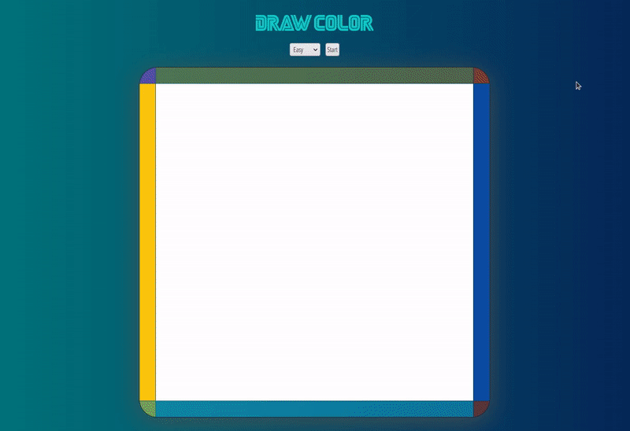
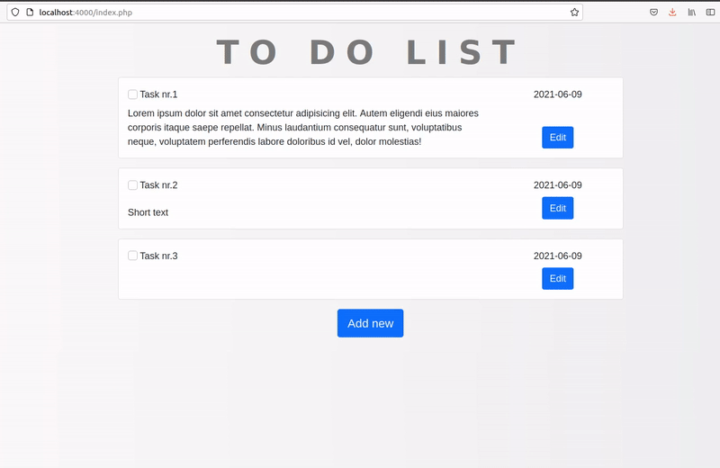

- [background-generator](#heading)
  * [Installation](#sub-heading)
  * [Description](#sub-heading-1)
- [color-draw-game](#heading-1)
  * [Installation](#sub-heading-2)
  * [Description](#sub-heading-3)
- [python-for-everyone-exercises](#heading-2)
  * [Installation](#sub-heading-4)
- [To-do-list_PHP-mySQL](#heading-3)
  * [Installation](#sub-heading-5)
  * [Description](#sub-heading-6)


# talking-about-practice

> Various assignments, exercises, homeworks. Not a game.

<!-- toc -->

## background-generator

### Installation

* Copy files to yout pc and open index.html file

### Description

* Generates random linear gradient
* Ability to set gradient manually
* Ability to copy current gradient settings for future use


## color-draw-game

### Installation

* Copy files to yout pc and open index.html file

### Description

* You must find hidden button by coloring empty space
* button appears in random locations within drawing area
* game ends, when you click hidden button




## python-for-everyone-exercises

These exercises are solutions for book "Python for Everybody: Exploring Data in Python 3"

In each .py fole you can see exercise description and solution below.

You can get it for free here: [https://www.py4e.com/book](https://www.py4e.com/book) 

### Installation

1. copy files to your pc 

2. Run python code in your terminal
```
python p4e_9_4_dict_most_received_emails.py 
```

3. See results in your terminal
```
cwen@iupui.edu   5
```

## To-do-list_PHP-mySQL

### Installation

1. Import "to_do.sql" to your database
```
mysql -u root -p to_do < ..../To-do-list_PHP-mySQL/to_do.sql
```

2. Change database info in "database.php"
```
<?php
//Username and Password must be changed to actual one
$dbServername = "localhost";
$dbUsername = 'root';
$dbPassword = 'root';
$dbName = "to_do";
```

3. Run PHP environment
```
php -S localhost:4000
```

### Description

* User can add task to to-do list
* User can edit any added task
* User can delete any added task
* User can mark task as done
* All tasks are saved in mySQL database




